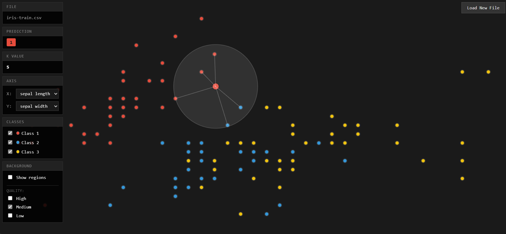

# KNN Visualizer

**This Project is co-work with Cursor**

This project is a customized fork of [`Pietot/KNN-Visualizer`](https://github.com/Pietot/KNN-Visualizer), adapted to focus on **CSV-based datasets** (e.g. the Iris dataset) and a cleaner, minimal UI.

The original project by Pietot is an excellent interactive visualization of K‑Nearest Neighbors in 2D.  
You can find it here: [`https://github.com/Pietot/KNN-Visualizer`](https://github.com/Pietot/KNN-Visualizer).

## 1. What’s different in this fork?

### 1.1 CSV-based data instead of random points

- The original app generates clustered points randomly on the canvas.
- This fork is designed around **loading CSV files**:
  - CSV format:  
    `feature1,feature2,...,label`  
    (last column is treated as the class label)
  - Example: the Iris dataset (`iris-train.csv`) with 4 features + label.
- All KNN computations (points, neighbors, background regions) are based on the loaded CSV data.

### 1.2 Axis (feature) selection

- You can choose **any two features** from the CSV as the visualization axes:
  - X axis: dropdown list of feature columns
  - Y axis: dropdown list of feature columns
- This allows you to explore different 2D projections of high‑dimensional data.

### 1.3 Class filters (2 of 4, 3 of 4, or all)

- Instead of pre-set “2 / 3 / 4 / 5 classes”, this fork:
  - Automatically detects all **unique labels** from the CSV.
  - Shows a checkbox list: `Class 1`, `Class 2`, `Class 3`, … with a color dot.
- You can:
  - Turn classes on/off to simulate “2 of 3”, “3 of 4”, etc.
  - Immediately see how the decision regions change when some classes are hidden.

### 1.4 Generalized for multiple datasets

- Any CSV that matches the simple format will work:
  - First N columns must be numeric features.
  - Final column is the label (string or number).
- The app:
  - Parses headers automatically.
  - Adapts axis dropdowns and class list.
  - Rescales coordinates to fill the canvas with padding.

### 1.5 UI & visual changes

- **Monochrome UI, colored data**:
  - Overall theme: black / dark gray background, minimal controls.
  - Data points and KNN background regions use a **colorful palette** (red, blue, yellow, green, purple, etc.) per class.
- **Layout changes**:
  - Left side: vertical stacked control panels (File, Prediction, K Value, Axis, Classes, Background).
  - Right top corner: `Load New File` button.
  - Bottom right: loading indicator for background computation.
- All UI text is in **English**.

### 1.6 Interaction and controls

Most of the original interaction model is preserved, but adapted to CSV data:

- **K value**:
  - Mouse wheel / trackpad scroll (desktop).
  - Arrow up / down keys.
- **Background decision regions**:
  - `Show regions` checkbox to toggle the KNN decision background.
  - Background is computed in a Web Worker (`background-worker.js`) for responsiveness.
  - Quality options: High / Medium / Low (controls the sampling step).
- **File loading**:
  - Start screen: click or drag‑and‑drop a `.csv` file.
  - In the main view: `Load New File` (top right) returns to the upload screen.

## 2. How to use

1. Open `index.html` in a modern browser (Chrome/Edge/Firefox).
2. On the upload screen:
   - Click the upload area or drag a `.csv` file into it.
3. After loading:
   - Choose **X** and **Y** features from the axis dropdowns.
   - Use the **class checkboxes** to select which labels to display.
   - Scroll or use arrow keys to adjust **K**.
   - Enable **Show regions** to render KNN decision regions in the background.

Recommended test file: `iris-train.csv` in this repository.

## 3. Technical notes

- Front‑end only: HTML + CSS + vanilla JavaScript.
- KNN background is computed in `background-worker.js` to keep the UI responsive.
- Coordinate scaling:
  - Each chosen feature is min–max normalized to \[0, 1\].
  - Then mapped into canvas space with padding margins.
- Color mapping:
  - Each unique label is assigned a color from a fixed palette.
  - The same mapping is passed to the Web Worker so the background colors match the point colors.

## 4. Credits

- **Original project**: [`Pietot/KNN-Visualizer`](https://github.com/Pietot/KNN-Visualizer) – real‑time KNN visualization with random clustered points.
- **Original website inspiration**: [`http://vision.stanford.edu/teaching/cs231n-demos/knn/`](http://vision.stanford.edu/teaching/cs231n-demos/knn/)
- **Original design inspiration**: [`https://codepen.io/gangtao/pen/PPoqMW`](https://codepen.io/gangtao/pen/PPoqMW)

